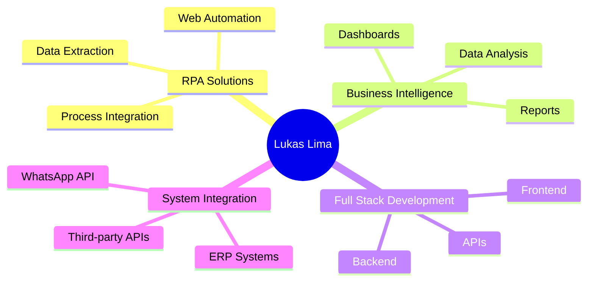

<div align="center">
  
# 🔥 Lukas Lima


<p align="center">
  <a href="mailto:lukaslimalkl@gmail.com">
    
  </a>
  <a href="https://www.linkedin.com/in/lukaslimalkl/">
    
  </a>
  <a href="https://github.com/lukasglimalkl">
    
  </a>
</p>

---

### 👨‍💻 Sobre Mim
```typescript
const lukas = {
    role: "Full Stack Developer & Automation Specialist",
    company: "NODDIO",
    location: "Brasil 🇧🇷",
    focus: ["RPA Solutions", "Business Intelligence", "System Integration"],
    currentlyLearning: ["Advanced Go", "Cloud Architecture", "AI Integration"],
    funFact: "Transformo processos complexos em automações elegantes ⚡"
};
```

</div>

---

## 🛠️ Tech Stack

<div align="center">

### 💻 Languages


### 🚀 Frameworks & Libraries


### 🗄️ Databases & Tools


</div>

---

## 📊 GitHub Analytics

<div align="center">
  
  
</div>

<div align="center">
  
</div>

---

## 🎯 Áreas de Especialização

<div align="center">


</div>

---

## 🏆 Achievements & Highlights

<div align="center">

| 🎯 Metric | 📈 Value |
|:---------:|:--------:|
| **Years of Experience** | 3+ |
| **Projects Delivered** | 50+ |
| **Lines of Code** | 100k+ |
| **Happy Clients** | 20+ |

</div>

---

## 💼 Featured Projects

<div align="center">

| Project | Description | Tech Stack |
|---------|-------------|------------|
| 🏠 **CEF RPA System** | Automated data extraction from housing portal | Go, Chromedp, Selenium |
| 📊 **BI Dashboards** | Real-time business intelligence solutions | React, Node.js, PostgreSQL |
| 🤖 **WhatsApp Automation** | Marketing and customer service automation | JavaScript, APIs |
| 🏗️ **ERP Integration** | Custom ERP system development | Next.js, TypeScript, SQL |

</div>

---

## 📫 Let's Connect!

<div align="center">

**💬 Open for new opportunities and collaborations!**

[](mailto:lukaslimalkl@gmail.com)
[](https://www.linkedin.com/in/lukaslimalkl/)
[](https://github.com/lukasglimalkl)

</div>

---

<div align="center">
  
### 💭 Quote of the Day
  


---


**✨ "Code is poetry, automation is art" ✨**


</div>
